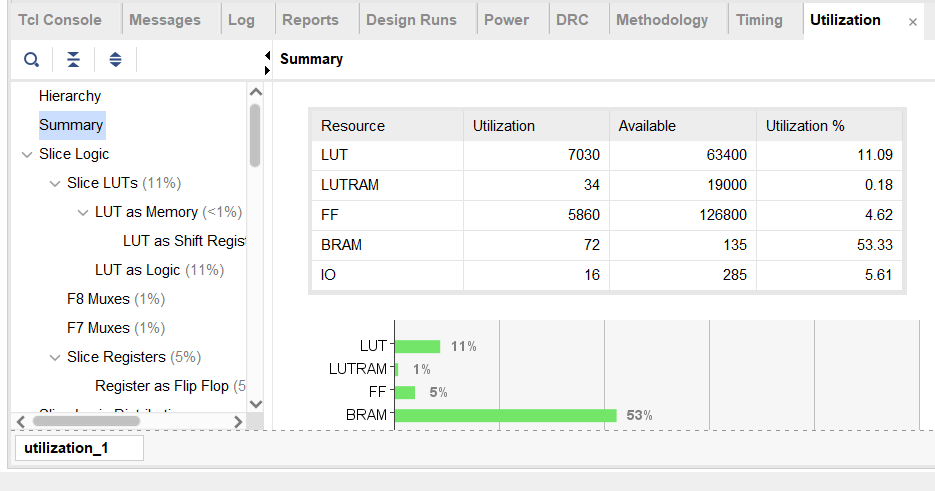

#Read me

## Task 1

### 项目文件及配置

本任务项目中包含设计文件：	

	Multiplier.v,   Calculation.v,  Core.v

仿真文件：

	TB_Core.v,  TB_Multiplier.v,  TB_CC.v

其中TB_Multiplier.v仅用于Multiplier.v的仿真检验，TB_CC仅用于CalculationCore.v的仿真检验。在项目的仿真及综合实验中不包含此两文件，应将TB_Core.v设为顶层文件。

在文件Core.v中，三个ip核的设置如下：

	input_BRAM : Single Port RAM，端口宽度512位，深度1024位，端口使能Always Enabled，操作模式为Write First，使用Primitive Output Register;
	kernel_BRAM：Single Port RAM，端口宽度512位，深度 576位，端口使能Always Enabled，操作模式为Write First，使用Primitive Output Register;
	output_BRAM: Simple Dual Port RAM，端口宽度1536位，深度1024位，A、B端口均设置为Always Enabled，操作模式Write First，端口B不使用Output Registers;

### 计算模式

#### 测试数据生成

使用python脚本data_generator.py以生成测试数据，input数据以十六进制存储与iB.coe中，kernel数据以十六进制存储于kB.coe中，结果以十六进制存储于ans.txt中。

在每次仿真和综合实验时，独立生成一组数据并导入计算模块，观察结果。

#### 数据存储
计算的input矩阵及kernel矩阵存储于input_BRAM iB和kernel_BRAM kB中。

iB中的每一行数据代表64个channel中对应位置的8位整数。
即位于Channel c，m行，n列的八位整数对应iB中地址为$m*32 + n$对应数据的$[8*c+7: 8*c]$部分。

kB中的每一行代表固定outputChannel和位置，64个inputChannel中对应的8位整数。
即位于inputChannel ic, outputChannel oc，m行，n列的八位整数对应kB中地址为$64*(3*m + n) + oc$对应数据的$[8*ic + 7: 8*ic]$部分。

计算结果最终存储在output_BRAM oB中。

oB中的每一行数据代表64个channel中对应位置的24位整数。
即，位于Channel c， m行，n列的24位整数对应oB中地址为$m*32 + n$对应数据的$[24*c +23, 24*c]$部分。

#### 模组接口

计算模组Core的接口为：

	input clk;               时钟信号接口
	input rst_n;             复位信号接口（高电平有效）
	input en;                使能信号，高电平进行计算，低电平时停止计算
	input [11: 0] addr;      地址信号，在en信号低时有效，前两位控制BRAM编号，后10位代表对应地址。
	output [1535: 0] Data;   输出数据，在en信号低时有效，输出addr对应位置的数据，多余位置以0补足。

在综合及排线过程中，Data宽度改为一位以防止IO资源不足，仅输出对应数据的第一位。

#### 计算单元

计算循环使用64个八位乘法器搭建的向量乘法器，每次接收两个512位的数据（长度为64的8位向量），输出24位符号数，对应两个输入向量的点积。

#### 计算过程

在单个周期中，取出iB，kB中对应地址的输入数据。
随后将两个输入向量送入计算单元得到其点积，并取出oB中对应位置的中间结果。
判断点积对应位置是否在结果矩阵中，若是，则将点积与中间结果对应位置的24位符号数相加，并以此替代中间结果存入oB的对应位置。

在整个计算过程中，优先固定iB的地址，循环kB的地址，在循环过程中生成oB地址以存入。这中方法实现较为容易，并且易于检验流程结束。缺点是oB地址切换比较频繁，中间过程不甚清晰。

#### 具体实现

在计算过程中，优先生成循环的行、列信号(m、n、c等)，利用这些信号生成循环的地址信号，易于查验以及周期检验。

在内部信号传递过程中使用大量的寄存器以保存周期对应信号。

### 计算结果

模组在仿真上表现良好，能够正常进行计算并存储结果。理论计算周期数为589831个周期(589824次计算加延迟7个周期输出结果)。

卷积计算总乘法次数为(不计在padding处的乘法)为36192256次，理论计算效率为：$36192256/(64\times 589831)\approx 95.88\%$。

### 资源占用

模组的资源使用率如下图：(使用AX7101开发板)
